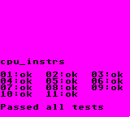

# wasmBoy

<!--- Badges -->
[](https://travis-ci.org/torch2424/wasmBoy)

<!--- Short Description-->
🎮👾🕹️ Gameboy Emulator Library written in Web Assembly using [AssemblyScript](https://github.com/AssemblyScript/assemblyscript), Debugger/Shell in Preact 🎮👾🕹️


*🎵 Click the image below for a quick video of a sound test the Alpha version 🎵*


[](https://www.youtube.com/watch?v=LqH495sZ6ns)

# Features

* Emulates the gameboy and outputs graphics to an HTML5 canvas 🖼️, and audio through the Web Audio API 🔊
* Importable into other projects as a dependency ♻️
* Built with Web Assembly 🕸️
* Keyboard and gamepad input support ⌨️ 🎮
* Debugger with information of all relevant registers 🐛

[Please see the Roadmap for upcoming features](#roadmap)

# Screenshots

**Coming soon!**

For now I would watch the video posted at the top of the readme :)

# Tests

### Blarrg

**cpu_instrs**



# Roadmap

The project doe quality and performance also depends on the [AssemblyScript Roadmap](https://github.com/AssemblyScript/assemblyscript/wiki/Status-and-Roadmap).

The Wasmboy library is being recorded at [Issue #3](https://github.com/torch2424/wasmBoy/issues/3)

# CLI Commands / Npm Scripts

The project contains three different elements.

* The `debugger` is the container for the wasmBoy library, which is simply a [preact](https://github.com/developit/preact) application, generated with [preact-cli](https://github.com/developit/preact-cli).
* The `wasm` which is the web assembly module for wasmBoy written in [AssemblyScript](https://github.com/AssemblyScript/assemblyscript).
* The `lib` which is the importable library of wasmBoy that can be used in other projects.

Each of these uses a different build process. The debugger uses [webpack](https://webpack.js.org/), the wasm uses the [AssemblyScript](https://github.com/AssemblyScript/assemblyscript) compiler CLI tool, and the lib uses [Rollup.js](https://rollupjs.org/guide/en).

Commands for each part of the project will be prepended with their element name and a colon, e.g `debugger:[command here]`.

Commands not prepended with a colon are meant for easily building on all of the different parts as a whole.

``` bash
# Command to serve the project, and watch the debugger, wasm, and lib for changes
# Uses concurrently: https://github.com/kimmobrunfeldt/concurrently
# Concurrently helps cleanup the output and organizes all three watchers/servers
npm start

# Same as npm start
npm run dev

# Same as npm start
npm run watch

# Build the wasm module and the lib to be ready to be pushed to npm or released
npm run build

# Run tests in `test/test.js`
npm run test

# Watch the debugger (preact) project for changes and livereload
npm run debugger:watch

# Build the debugger (preact) project and serve it
npm run debugger:serve

# Build the debugger (preact) project
npm run debugger:build

# Watch the wasm (AssemblyScript) *.ts files and build on changes
npm run wasm:watch

# Build the wasm (AssemblyScript) *.ts files, with the correct CLI flags
npm run wasm:build

# Watch the Wasmboy ES6 Module for changes, and build
npm run lib:watch

# Build the WasmBoy Es6 module
npm run lib:build
```

The debugger application/container for wasmBoy utilizes the [preact-cli](https://github.com/developit/preact-cli/blob/master/README.md). Additional workflow commands and tips can be found there.

# Special Thanks

* [awesome gb-dev communitty](https://github.com/avivace/awesome-gbdev), too many rad dudes to name!

* [dcodeIO for building and fixing bugs with AssemblyScript](https://github.com/AssemblyScript/assemblyscript). And for being awesome!

* [r/emudev](https://www.reddit.com/r/EmuDev/), especially to [binjimint](https://www.reddit.com/r/EmuDev/comments/7y2bux/gameboy_gb_graphical_bugs_game_writes_zeroes_into/dudlj3w/) for helping me find that bug not even Blargg's cpu tests could find.

# Random Tips for new Gameboy EmuDevs:

* It's better to code an emulator by abstracting assembly commands into functions, rather than by Opcode operation

* Gameboy Opcodes are difficult till about 0x40

# Resources

* [awesome gbdev](https://github.com/avivace/awesome-gbdev) for reference material, and getting help from the awesome discord community

* [node-gameboy](https://github.com/nakardo/node-gameboy) and [gomeboycolor](https://github.com/djhworld/gomeboycolor) for comparison for when I'm **REALLY** stuck.

* [Codeslinger's Guide for General HOW-TO](http://www.codeslinger.co.uk/pages/projects/gameboy.html)

* [tomek's Retrospective for General Roadmap](http://blog.rekawek.eu/2017/02/09/coffee-gb/)

* [Awesome Wiki on the Gamelad project](https://github.com/Dooskington/GameLad/wiki)

* [Opcode Table](http://pastraiser.com/cpu/gameboy/gameboy_opcodes.html)

* [Opcode Instructions](https://rednex.github.io/rgbds/gbz80.7.html)

* [Spreadsheet of Game that Do or Do Not Rom Bank](https://docs.google.com/spreadsheets/d/1cOS__xEj8bBT7cqEDgJcYStKuFAS8mMA4uErx9kA40M/edit#gid=1827536881)

* [How Does Digital Audio Even?](https://www.youtube.com/watch?v=1RIA9U5oXro)

* [Sound Emulation - GhostSonit's reply](https://www.reddit.com/r/EmuDev/comments/5gkwi5/gb_apu_sound_emulation/)

* [Gameboy Sound Hardware](http://gbdev.gg8.se/wiki/articles/Gameboy_sound_hardware)

* [Gameboy Sound Operation](https://gist.github.com/drhelius/3652407)
