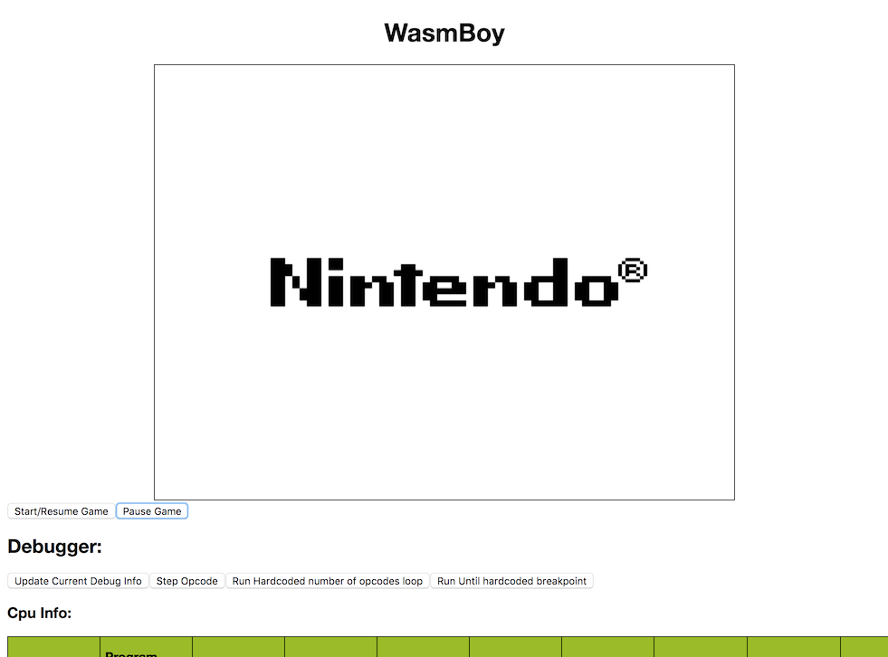

# wasmBoy
Gameboy Emulator written in Web Assembly using [AssemblyScript](https://github.com/AssemblyScript/assemblyscript), Debugger/Shell in Preact



---
# THIS IS A WIP
---

# Features

* As of February 6th, 2018, it runs the [Boot Rom](http://gbdev.gg8.se/wiki/articles/Gameboy_Bootstrap_ROM)!

* That's about it haha!

# Roadmap

The project doe quality and performance also depends on the [AssemblyScript Roadmap](https://github.com/AssemblyScript/assemblyscript/wiki/Status-and-Roadmap)

And please see [Issue #3](https://github.com/torch2424/wasmBoy/issues/3)

# Resources

* [awesome gbdev](https://github.com/avivace/awesome-gbdev) for reference material, and getting help from the awesome discord community

* [node-gameboy](https://github.com/nakardo/node-gameboy) and [gomeboycolor](https://github.com/djhworld/gomeboycolor) for comparison for when I'm **REALLY** stuck.

* [Codeslinger's Guide for General HOW-TO](http://www.codeslinger.co.uk/pages/projects/gameboy.html)

* [tomek's Retrospective for General Roadmap](http://blog.rekawek.eu/2017/02/09/coffee-gb/)

* [Opcode Table](http://pastraiser.com/cpu/gameboy/gameboy_opcodes.html)

* [Opcode Instructions](https://rednex.github.io/rgbds/gbz80.7.html)

* [Spreadsheet of Game that Do or Do Not Rom Bank](https://docs.google.com/spreadsheets/d/1cOS__xEj8bBT7cqEDgJcYStKuFAS8mMA4uErx9kA40M/edit#gid=1827536881)

* [Sound Emulation - GhostSonit's reply](https://www.reddit.com/r/EmuDev/comments/5gkwi5/gb_apu_sound_emulation/)

### Random Things I've Learned:

* It's better to code an emulator by abstracting assembly commands into functions, rather than by Opcode operation

* Gameboy Opcodes are difficult till about 0x40

### CLI Commands

``` bash
# install dependencies
npm install

# serve with hot reload at localhost:8080
npm run dev

# Watch wasm/ folder for changes, and rebuild on changes
npm run wasm:watch

# build for production with minification
npm run build

# Build the wasm into a wasm module
npm run wasm:build

# test the production build locally
npm run serve
```

For detailed explanation on how things work, checkout the [CLI Readme](https://github.com/developit/preact-cli/blob/master/README.md).
