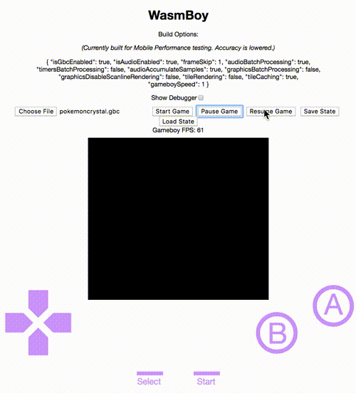
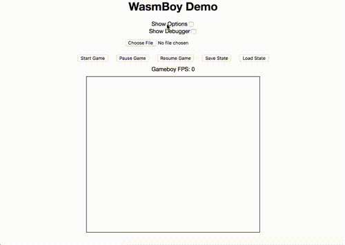
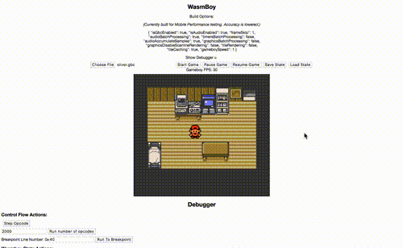

# wasmboy

<!--- Badges -->

[](https://travis-ci.org/torch2424/wasmBoy)


[](https://www.buymeacoffee.com/torch2424)

<!--- Short Description-->

🎮👾🕹️ Gameboy Emulator Library written in Web Assembly using [AssemblyScript](https://github.com/AssemblyScript/assemblyscript), Debugger/Shell in Preact 🎮👾🕹️

[Debugger / Demo with support for mobile controls](https://torch2424.github.io/wasmBoy/)

<!-- Header gif -->



<!-- Generated with: https://github.com/ekalinin/github-markdown-toc -->

# Table of Contents

- [Features](#features)
- [Example Gifs &amp; Screenshots](#example-gifs--screenshots)
- [Tests](#tests)
  - [Blarrg](#blarrg)
- [Roadmap](#roadmap)
- [Contributing](#contributing)
  - [Installation](#installation)
  - [CLI Commands / Npm Scripts](#cli-commands--npm-scripts)
- [Notable Projects](#notable-projects)
- [Special Thanks](#special-thanks)
- [Random Tips for new Gameboy EmuDevs](#random-tips-for-new-gameboy-emudevs)
- [Resources](#resources)

# Features

- Emulates the Gameboy / Gameboy Color 🎮👾🕹️
- Outputs graphics to a scalable / responsive HTML5 canvas 🖼️, and audio through the Web Audio API 🔊
- Support for In-game saves, and save states 💾
- Configurable options to increase performance for low(er) end devices 🔥
- _WIP:_ Importable into other projects as a dependency ♻️
- Built with Web Assembly 🕸️
- Keyboard and gamepad input support using [responsive gamepad](https://www.npmjs.com/package/responsive-gamepad) ⌨️ 🎮
- Debugger with a value table (I/O map), Tile Data visualizer, and Background Map with Scroll Indicators 🐛

[Please see the Roadmap for upcoming features](#roadmap)

# Example Gifs & Screenshots

**Gameboy Support**

    

**Gameboy Color Support**

     

**Options & Save States**



**Debugger**



# Tests

### Blarrg

**cpu_instrs**


# Roadmap

The project doe quality and performance also depends on the [AssemblyScript Roadmap](https://github.com/AssemblyScript/assemblyscript/wiki/Status-and-Roadmap).

The Wasmboy library is being recorded at [Issue #3](https://github.com/torch2424/wasmBoy/issues/3)

# Contributing

Feel free to fork and submit PRs! Any help is much appreciated, and would be a ton of fun!

### Installation

Just your standard node app. Install Node with [nvm](https://github.com/creationix/nvm), `git clone` the project, and `npm install`, and you should be good to go!

### CLI Commands / Npm Scripts

The project contains three different elements.

- The `debugger` is the container for the wasmboy library, which is simply a [preact](https://github.com/developit/preact) application, generated with [preact-cli](https://github.com/developit/preact-cli).
- The `core` or `wasm` which is the web assembly module for wasmboy written in [AssemblyScript](https://github.com/AssemblyScript/assemblyscript).
- The `lib` which is the importable library of wasmboy that can be used in other projects, that adds a top level API to the `core`.

Each of these uses a different build process. The debugger uses [webpack](https://webpack.js.org/), the wasm uses the [AssemblyScript](https://github.com/AssemblyScript/assemblyscript) compiler CLI tool, and the lib uses [Rollup.js](https://rollupjs.org/guide/en).

Commands for each part of the project will be prepended with their element name and a colon, e.g `debugger:[command here]`.

Commands not prepended with a colon are meant for easily building on all of the different parts as a whole.

```bash
# Command to serve the project, and watch the debugger, wasm, and lib for changes
# Uses concurrently: https://github.com/kimmobrunfeldt/concurrently
# Concurrently helps cleanup the output and organizes all three watchers/servers
npm start

# Same as npm start
npm run dev

# Same as npm start
npm run watch

# Build the wasm module and the lib to be ready to be pushed to npm or released
npm run build

# Run tests in `test/accuracy/test.js`
npm run test

# Run tests in `test/performance/test.js`
npm run test:performance

# Watch the debugger (preact) project for changes and livereload
npm run debugger:watch

# Build the debugger (preact) project and serve it
npm run debugger:serve

# Build the debugger (preact) project
npm run debugger:build

# Watch the wasm (AssemblyScript) *.ts files and build on changes
npm run core:watch

# Build the wasm (AssemblyScript) *.ts files, with the correct CLI flags
npm run core:build

# Watch the Wasmboy ES6 Module for changes, and build
npm run lib:watch

# Build the WasmBoy Es6 module
npm run lib:build
```

The debugger application/container for wasmboy utilizes the [preact-cli](https://github.com/developit/preact-cli/blob/master/README.md). Additional workflow commands and tips can be found there.

Using the [gh-pages](https://www.npmjs.com/package/gh-pages) for debugger/demo deployment onto gh-pages.

# Notable Projects

- [VaporBoy](https://github.com/torch2424/vaporBoy) - PWA for playing ROMs with WasmBoy!

- [wasmboy-rs](https://github.com/CryZe/wasmboy-rs) - Wasmboy Compiled to Rust, for native executables and additional cool features!

- [wasmboy.py](https://bitbucket.org/windel/ppci/src/default/examples/wasm/wasmboy.py?fileviewer=file-view-default) - Wasmboy running in Python!

# Special Thanks

- [awesome gb-dev communitty](https://github.com/avivace/awesome-gbdev), too many rad dudes to name!

- [dcodeIO for building and fixing bugs with AssemblyScript](https://github.com/AssemblyScript/assemblyscript). And for being awesome!

- [r/emudev](https://www.reddit.com/r/EmuDev/), especially to [binjimint](https://www.reddit.com/r/EmuDev/comments/7y2bux/gameboy_gb_graphical_bugs_game_writes_zeroes_into/dudlj3w/) for helping me sooooo much!

# Random Tips for new Gameboy EmuDevs

- It's better to code an emulator by abstracting assembly commands into functions, rather than by Opcode operation

- Gameboy Opcodes are difficult till about 0x40

# Resources

- [awesome gbdev](https://github.com/avivace/awesome-gbdev) for reference material, and getting help from the awesome discord community

- [node-gameboy](https://github.com/nakardo/node-gameboy), [binjigb](https://github.com/binji/binjgb), [gomeboycolor](https://github.com/djhworld/gomeboycolor) for comparison for when I'm **REALLY** stuck.

- [Codeslinger's Guide for General HOW-TO](http://www.codeslinger.co.uk/pages/projects/gameboy.html)

- [tomek's Retrospective for General Roadmap](http://blog.rekawek.eu/2017/02/09/coffee-gb/)

- [Awesome Wiki on the Gamelad project](https://github.com/Dooskington/GameLad/wiki)

- [Opcode Table](http://pastraiser.com/cpu/gameboy/gameboy_opcodes.html)

- [Opcode Instructions](https://rednex.github.io/rgbds/gbz80.7.html)

- [Spreadsheet of Game that Do or Do Not Rom Bank](https://docs.google.com/spreadsheets/d/1cOS__xEj8bBT7cqEDgJcYStKuFAS8mMA4uErx9kA40M/edit#gid=1827536881)

- [How Does Digital Audio Even?](https://www.youtube.com/watch?v=1RIA9U5oXro)

- [Sound Emulation - GhostSonit's reply](https://www.reddit.com/r/EmuDev/comments/5gkwi5/gb_apu_sound_emulation/)

- [Gameboy Sound Hardware](http://gbdev.gg8.se/wiki/articles/Gameboy_sound_hardware)

- [Gameboy Sound Operation](https://gist.github.com/drhelius/3652407)

- [Google Material Icons](https://material.io/icons/)

- [The Cycle Accurate Game Boy Docs](https://github.com/AntonioND/giibiiadvance/blob/master/docs/TCAGBD.pdf)

- [Demos for perf testing GB/GBC](http://privat.bahnhof.se/wb800787/gb/demos/)
