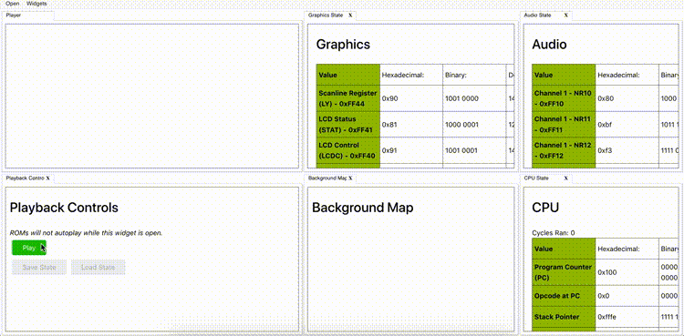

# wasmboy

<!--- Badges -->

[](https://travis-ci.org/torch2424/wasmBoy)


[](https://wapm.io/package/torch2424/wasmerboy)


<!--- Short Description-->

🎮👾🕹️ Gameboy Emulator Library written in Web Assembly using [AssemblyScript](https://github.com/AssemblyScript/assemblyscript), Demos in [Preact](https://preactjs.com/) and [Svelte](https://svelte.dev/) 🎮👾🕹️

**Project is still < 1.0.0. Most games are playable, but the emulator is still not very accurate. Expect bugs.**

[Core/Lib Documentation](https://github.com/torch2424/wasmBoy/wiki)

[Talk given at WebAssembly SF March 28th, 2019](https://youtu.be/ZlL1nduatZQ)

<!-- Header Images -->



<!-- Generated with: https://github.com/ekalinin/github-markdown-toc -->

# Table of Contents

- [Features](#features)
- [Usage](#usage)
  - [Supported Platforms](#supported-platforms)
- [In-Game Screenshots](#in-game-screenshots)
  - [Gameboy Support](#gameboy-support)
  - [Gameboy Color Support](#gameboy-color-support)
- [Demo Applications](#demo-applications)
  - [Debugger](#debugger)
  - [Benchmark](#benchmark)
  - [Iframe Embed](#iframe-embed)
- [Tests](#tests)
  - [Blarrg](#blarrg)
  - [Mooneye](#mooneye)
    - [Timing](#timing)
    - [Halt](#halt)
- [Contributing](#contributing)
  - [Installation](#installation)
  - [CLI Commands / Npm Scripts](#cli-commands--npm-scripts)
- [Notable Projects](#notable-projects)
- [Special Thanks](#special-thanks)
- [Resources](#resources)

# Features

- Emulates the Gameboy / Gameboy Color 🎮👾🕹️
- Outputs graphics to a scalable / responsive HTML5 canvas 🖼️, and audio through the Web Audio API 🔊
- Support for In-game saves, and save states 💾
- Configurable options to increase performance for low(er) end devices 🔥
- Importable into other projects as a dependency ♻️
- Built with Web Assembly 🕸️
- Uses Web Workers for parallelized rendering 🛠️
- Keyboard and gamepad input support using [responsive gamepad](https://www.npmjs.com/package/responsive-gamepad) ⌨️ 🎮
- Debugger with a value table (I/O map), Tile Data visualizer, and Background Map with Scroll Indicators 🐛
- Runs in both Browser and Node 🌐

# Usage

**Project is still < 1.0.0. Most games are playable, but the emulator is still not very accurate. Expect bugs.**

[1.0 Roadmap Tracking Issue](https://github.com/torch2424/wasmBoy/issues/197)

Simply install through npm:

`npm install --save wasmboy`

Documentation for the project can be found on the [WasmBoy Wiki](https://github.com/torch2424/wasmBoy/wiki).

### Supported Platforms

Try to test and aim for support on all major browsers (Chrome, Firefox, and Safari). Also, Node support works with the [`headless` option in the WasmBoy config](https://github.com/torch2424/wasmBoy/wiki/Lib-API#wasmboyoptions), and using the [Worker Threads](https://nodejs.org/api/worker_threads.html) `--experimental-worker` flag.

# In-Game Screenshots

### Gameboy Support

    

### Gameboy Color Support

     

# Demo Applications

### Debugger

[Application Link](https://wasmboy.app/)

A full debugger meant for analyzing the internals of the gameboy. Great for HomeBrew Gameboy Development, or using as a reference point for building your own GameBoy emulator. **See the gif at the top of the README for an example.**

**Features**

- Support of all Gameboy Components: CPU, PPU (Graphics), APU (Audio), Memory, Interrupts, and Timers. 🎮
- Per cycle state of each Game Boy components data, internal registers, and relevant memory addresses. 🌐
- Loaded ROM Information and parsing of the [Cartridge Header](http://gbdev.gg8.se/wiki/articles/The_Cartridge_Header). 💾
- CPU Control options. Stepping per opcode, and breakpoints. 🧠
- Graphics Background Map, with border for current "camera" location with respect to scroll registers. 🖼️
- Graphics Tile Data, to display the loaded tiles currently loaded across all VRAM Banks. 🎨
- WasmBoy Control options. Play, Pause, Save State, and Load State. ⏯️ 📚
- Ability to log the entire WasmBoy Library Object and Memory to the DevTools Console. 🖥️
- Highly productive "Docker" layout, with snapping of widgets onto sections of the screen and tab support. ⚓
- Saved Layouts between sessions. 💠
- Help widget with tips on how to be effective in the debugger. 🙋

**Mobile Demo**

For UI/UX reasons, on mobile the debugger is simply a web app for testing the lib. This is useful for testing a ROM on the go. For playing games, I would suggest [VaporBoy](https://vaporboy.net/). Below is an example of the mobile demo:


**Anaytics / Privacy**

[Analytics Wrapper Service](./demo/debugger/analytics.js)

Analytics is used on this application simply for performance monitoring, and tracking popularity of the applications. The following events are sent, with nothing more than the event name. The analytics provider used is [Google Analytics](https://analytics.google.com/analytics/web/).

- Whenever a new ROM is loaded, and played for the first time.
- Whether attempting to load a ROM was successful.
- Whenever a state is saved.
- Whenever a state is loaded.
- Whenever custom WasmBoy options are applied.
- Whenever the Google Drive option is selected.
- Whenever the mobile demo is manually reloaded.

### Benchmark

[Application Link](https://wasmboy.app/benchmark/)

[Medium Article](https://medium.com/@torch2424/webassembly-is-fast-a-real-world-benchmark-of-webassembly-vs-es6-d85a23f8e193)

Since WasmBoy is built in AssemblyScript, it can also run it's core through the Typescript compiler if we mock out some of the WebAssembly interface. The benchmarking tool was built as a way to compare WebAssembly performance to Javascript / ES6 performance, after compiling the core to both WebAssembly and Javascript. It includes detailed stats, live running output, and multiple graphs. Also great for comparing the performance of devices that run WasmBoy.

**Example**


**Anaytics / Privacy**

Analytics is used on this application simply for performance monitoring, and tracking popularity of the application. The following events are sent, with nothing more than the event name. The analytics provider used is [Google Analytics](https://analytics.google.com/analytics/web/).

- Whenever a new ROM is loaded from the particular source.
- Whenever the benchmark is ran.
- Whenever results are rendered for the benchmark.

### Iframe Embed

An Iframe embeddable version of WasmBoy. Simply provide information through [URL Query Params](https://en.wikipedia.org/wiki/Query_string), and embed a ROM on your website! Great for embedding your HomeBrew Game Boy / Game Boy Color games on your website, (WordPress) blog, and game hosting services such as [itch.io](https://itch.io/).

**Example**

[Example Tobu Tobu Girl, Homebrew Hub Iframe](https://wasmboy.app/iframe/?rom-name=Tobu%20Tobu%20Girl&play-poster=https://gbhh.avivace.com/database/entries/tobutobugirl/screenshot1.bmp&rom-url=https://gbhh.avivace.com/database/entries/tobutobugirl/tobu.gb)


**Usage**

Add an iframe to your website like the following:

```html
<iframe title="WasmBoy Iframe Embed" width="160" height="144" allowfullscreen="true" src="https://wasmboy.app/iframe/?[QUERY_PARAMS_GO_HERE]"> </iframe>
```

The iframe is configured by adding [URL Query Params](https://en.wikipedia.org/wiki/Query_string). The configuration params are:

- `rom-url` - **(Required)** The URL to the `.gb` or `.gbc` ROM that will be loaded, fetched, and played.
- `rom-name` - The name of the ROM being played.
- `play-poster` - The URL to the image shown at the intial "click to play", play poster.

Please ensure all assets that are being loaded by the iframe embed, such as ROMs and images, will work with [CORS](https://developer.mozilla.org/en-US/docs/Web/HTTP/CORS). The WasmBoy Iframe Embed will take the full width and height (100%) of it's iframe container. Thus, it will be up to your styling to ensure the iframe preserves the GameBoy 160x144 resolution.

**Anaytics / Privacy**

Analytics is used on this application simply for performance monitoring, and tracking popularity of the application. The analytics provider used is [Google Analytics](https://analytics.google.com/analytics/web/). Only basic user visit data is recorded / used.

# Tests

These are all currently known passing tests (by me), there may be more test roms out there that pass. Some tests may not pass, and that can either be because of the component it is testing is actually incorrect, or another component that the test is testing is not yet implemented, or is incorrect (e.g a lot of mooneye tests rely on Serial Interrupts, which this emulator has yet to implement). Feel free to open an issue or PR to add any more passing tests to this list 😄 . **The test names are listed from left to right, top to bottom**.

### Blarrg

[Repo with all blargg's tests and source](https://github.com/retrio/gb-test-roms)

cpu_instrs, instr_timing, mem_timing, mem_timing-2, halt_bug, cgb_sound


### Mooneye

[Mooneye GB Emulator / Tests](https://github.com/Gekkio/mooneye-gb)

#### Timing

div_write, rapid_toggle, tim00, tim00_div_trigger, tim01, tim01_div_trigger, tim10, tim10_div_trigger, tim11, tim11_div_trigger, tima_reload, tima_write_reloading, tma_write_reloading


#### Halt

halt_ime0_ei, halt_ime0_nointr_timing, halt_ime1_timing


# Contributing

Feel free to fork and submit PRs! Opening an issue is reccomended before starting any development, as a discussion would be nice on the idea / feature before writing code. Any help is much appreciated, and would be a ton of fun!

### Installation

Just your standard node app. Install Node with [nvm](https://github.com/creationix/nvm), `git clone` the project, and `npm install`, and you should be good to go!

### CLI Commands / Npm Scripts

The project contains three different elements.

- The `core` or `wasm` which is the web assembly module for wasmboy written in [AssemblyScript](https://github.com/AssemblyScript/assemblyscript).
- The `lib` which is the importable library of wasmboy that can be used in other projects, that adds a top level API to the `core`.
- The `demo`, which is a collection of different apps that are used for demoing purposes of the `lib` and `core`.

Most of the build process in this project is done using [Rollup.js](https://rollupjs.org/guide/en). Each element / component of the project is configured in its own `rollup.*.js` file, and are then all used within the standard `rollup.config.js` file by the rollup CLI. Also, The `core` wasm uses the [AssemblyScript](https://github.com/AssemblyScript/assemblyscript) compiler CLI tool.

Commands for each part of the project will be prepended with their element name and a colon, e.g `debugger:[command here]`.

Common command parts are:

- `dev` / `watch` - How the project should be served and developed with tools like reloading.
- `build` - Make production builds of the component / element of the project.

Commands not prepended with a colon are meant for easily building on all of the different parts as a whole.

Not all commands are documented, only ones relevant to making changes to the library for contributions. `*` represents the category of commands, and is not an actual command.

```bash
# Command to serve the project, and watch the debugger, wasm, and lib for changes
# Uses concurrently: https://github.com/kimmobrunfeldt/concurrently
# Concurrently helps cleanup the output and organizes watchers on commands that require concurrent tools

# Serve the general project for development (Watches the core, lib, and debugger)
npm run start

# Same as npm start
npm run dev

# Same as npm start
npm run watch

# Build everything to be ready to be pushed to npm or released
npm run build

# Linting commands used during precommit an tests
npm run prettier:*

# Commands for building/serving the core, offers commands for building with the Assemblyscript Compiler (WASM) or Typescript (JS)
npm run core:*

# Commands for building/serving the JS lib
npm run lib:*

# Run tests in `test/accuracy/test.js`
npm run test

# Run tests in `test/performance/test.js`
npm run test:performance

# All commands for testing, and are test related
npm run test:*

# Commands for the building / serving the debugger
npm run debugger:*

# Commands for building / serving the benchmark tool
npm run benchmark:*

# Commands for building / serving all available apps in wasmboy
npm run demo:*
```

Using the [gh-pages](https://www.npmjs.com/package/gh-pages) for debugger/demo deployment onto gh-pages.

# Notable Projects

- [VaporBoy](https://github.com/torch2424/vaporBoy) - PWA for playing ROMs with WasmBoy!

- [wasmboy-rs](https://github.com/CryZe/wasmboy-rs) - Wasmboy Compiled to Rust, for native executables and additional cool features!

- [wasmboy.py](https://bitbucket.org/windel/ppci/src/default/examples/wasm/wasmboy.py?fileviewer=file-view-default) - Wasmboy running in Python!

# Special Thanks

- [awesome gb-dev communitty](https://github.com/avivace/awesome-gbdev), too many rad dudes to name!

- [dcodeIO for building and fixing bugs with AssemblyScript](https://github.com/AssemblyScript/assemblyscript). And for being awesome!

- [r/emudev](https://www.reddit.com/r/EmuDev/), especially to [binjimint](https://www.reddit.com/r/EmuDev/comments/7y2bux/gameboy_gb_graphical_bugs_game_writes_zeroes_into/dudlj3w/) for helping me sooooo much!

- [mooneye GB](https://github.com/Gekkio/mooneye-gb) Thank you Gekkio for all the contributions to the communitty, and all the awesome tests!

- Blargg. Wherever you may be, thank you for all the awesome tests!

# Resources

- [Talk given at WebAssembly SF March 28th, 2019](https://youtu.be/ZlL1nduatZQ), general Wasm / AssemblyScript introduction, overview of WasmBoy and how it works.

- [awesome gbdev](https://github.com/avivace/awesome-gbdev) for reference material, and getting help from the awesome discord community

- [node-gameboy](https://github.com/nakardo/node-gameboy), [binjigb](https://github.com/binji/binjgb), [gomeboycolor](https://github.com/djhworld/gomeboycolor) for comparison for when I'm **REALLY** stuck.

- [Codeslinger's Guide for General HOW-TO](http://www.codeslinger.co.uk/pages/projects/gameboy.html)

- [tomek's Retrospective for General Roadmap](http://blog.rekawek.eu/2017/02/09/coffee-gb/)

- [Awesome Wiki on the Gamelad project](https://github.com/Dooskington/GameLad/wiki)

- [Opcode Table](http://pastraiser.com/cpu/gameboy/gameboy_opcodes.html)

- [Opcode Instructions](https://rednex.github.io/rgbds/gbz80.7.html)

- [Spreadsheet of Game that Do or Do Not Rom Bank](https://docs.google.com/spreadsheets/d/1cOS__xEj8bBT7cqEDgJcYStKuFAS8mMA4uErx9kA40M/edit#gid=1827536881)

- [How Does Digital Audio Even?](https://www.youtube.com/watch?v=1RIA9U5oXro)

- [Sound Emulation - GhostSonit's reply](https://www.reddit.com/r/EmuDev/comments/5gkwi5/gb_apu_sound_emulation/)

- [Gameboy Sound Hardware](http://gbdev.gg8.se/wiki/articles/Gameboy_sound_hardware)

- [Gameboy Sound Operation](https://gist.github.com/drhelius/3652407)

- [Google Material Icons](https://material.io/icons/)

- [The Cycle Accurate Game Boy Docs](https://github.com/AntonioND/giibiiadvance/blob/master/docs/TCAGBD.pdf)

- [Demos for perf testing GB/GBC](http://privat.bahnhof.se/wb800787/gb/demos/)

- [Homebrew Hub - Collection of GameBoy Homebrew](https://gbhh.avivace.com/)
